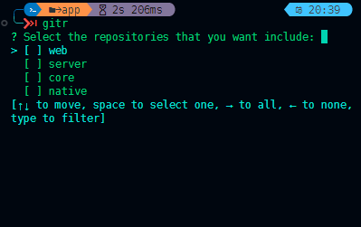

<center>

</center>

# gitr

**gitr** is a command-line tool that allows you to execute a command in multiple Git repositories simultaneously in a REPL interface. This tool can be helpful in automating tasks across multiple repositories, such as pulling updates, pushing changes, or running tests.

## Installation

To use Gitr, follow these steps:

#### Clone this repo

```bash
 $ git clone https://github.com/yourusername/gitr.git
```

Navigate to the cloned repository's directory and build the **gitr** executable using Cargo.

```bash
 $ cd gitr
 $ cargo build --release
```

#### Set Execution Permissions

```bash
chmod +x target/release/gitr
```

#### Create alias

Add the following line to your shell profile configuration file (e.g., `~/.bashrc`, `~/.zshrc`, or `~/.profile`):

```bash
alias gitr="path/to/gitr"
```

Now, Gitr is ready to use on your system. You can run **gitr** commands from any terminal window.

## Usage
Goto parent folder that has the repositories and start **gitr**:
```bash
 $ gitr
```

On the first run, **gitr** will prompt you to mark the repositories you want to include in its operations.



In **gitr**, you have access to all standard Git commands, in addition to some helpful gitr-specific functionalities:

 - `clear`: the terminal;
 - `branches`: Use the branches command to configure the repositories you want **gitr** to work with. This command allows you to set up and manage your environment, specifying which repositories gitr should consider in its operations.

## Contributing

We welcome contributions to gitr! If you have any suggestions, bug reports, or want to contribute to the development of gitr, please create a pull request or issue.